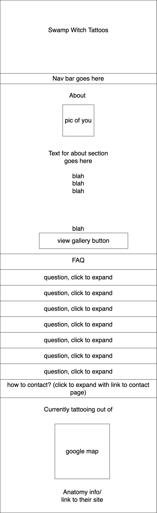

# Swamp Witch Tattoo

#### Epicodus Capstone project

#### Chynna Lew

## Technologies Used

* JavaScript
* Node Package Manager
* React
* CSS
* HTML

## Description
This application was created as a main portfolio/ homepage for a local tattoo artist

Requested Specifications:
Components:
- ABOUT ME (main scroll?)
- Gallery (standalone)
  - Main Gallery (fade in)
  - Flash (fade in)
  - Pet Portraits (fade in)
- FAQ (see good kind site for inspo) (main scroll)
- LOCATION (main scroll)
  -google map, link to anatomy tattoo site
- SHOP (link only)
  - link to big cartel (https://swampwitchtattoos.bigcartel.com/)
- CONTACT (standalone)
  - policies (terms and conditions) 
    -section on contact
    -- must read to continue (accept policies button)
    -- upload vax card to continue?
  - email form
    - their email (with confirm email is accurate)
    - inspo photos
    - placement
    - size
    - color? black and grey?
    - details
    - budget

## Diagrams / Component Layout

 

## Setup/Installation Requirements

* Download or clone [this](https://github.com/chynnalew/capstone) repository to your local machine
* Open the swamp-witch/ project directory in the terminal
* Run the command '$ npm install' to install the needed plugins and packages
* Open the application by running the command '$ npm run start'.

## Known Bugs
* No known bugs

## License

## Contact Information
[Chynna Lew](chynnalew@yahoo.com)
