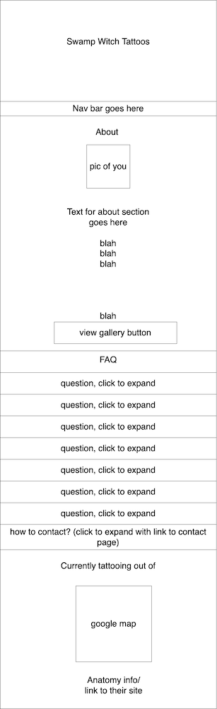
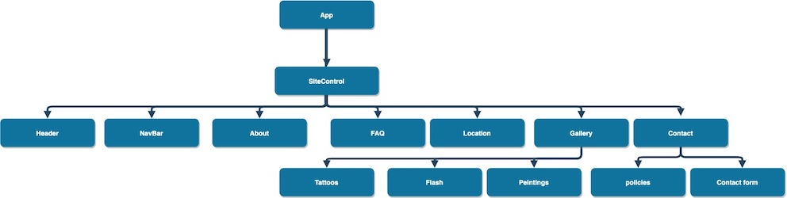

# Swamp Witch Tattoo

#### Epicodus Capstone project

#### Chynna Lew

## Technologies Used

* JavaScript
* Node Package Manager
* React
* CSS
* HTML
* formspark
* upload care
*

## Description
This application was created as a main portfolio/ homepage for a local tattoo artist

Requested Specifications:
Components:
- ABOUT ME (main scroll?)
- Gallery (standalone)
  - Main Gallery (fade in)
  - Flash (fade in)
  - Pet Portraits (fade in)
- FAQ (see good kind site for inspo) (main scroll)
- LOCATION (main scroll)
  -google map, link to anatomy tattoo site
- SHOP (link only)
  - link to big cartel (https://swampwitchtattoos.bigcartel.com/)
- CONTACT (standalone)
  - policies (terms and conditions) 
    -section on contact
    -- must read to continue (accept policies button)
    -- upload vax card to continue?
  - email form
    - their email (with confirm email is accurate)
    - inspo photos
    - placement
    - size
    - color? black and grey?
    - details
    - budget

## Diagrams / Component Layout

<br/>



## Setup/Installation Requirements

### This application requires a Formspark account, a UploadCare account, and a Google reCaptcha key
* visit [Formspark](https://formspark.io/) to obtain a form id
* visit [Google](https://www.google.com/recaptcha/admin) to set up a v2 account and obtain your keys
    * in your formspark settings, select Google reCaptcha v2 in the spam protection field and enter your Google ReCAPTCHA secret key
* visit [UploadCare](https://uploadcare.com/) to obtain an API key

* Download or clone [this](https://github.com/chynnalew/capstone) repository to your local machine
* create a .env file in the root project directory (capstone/swamp-witch)
* add the following code to the .env file, replacing YOUR_FORM_ID with your unique id provided by Formspark, YOUR_SITE_KEY with your site key provided by Google ReCAPTCHA, and YOUR_UPLOADCARE_KEY with your UploadCare public API key:
```
REACT_APP_FORM_ID = 'YOUR_FORM_ID'
REACT_APP_RECAPTCHA_KEY = 'YOUR_SITE_KEY'
REACT_APP_UPLOADCARE_KEY='YOUR_UPLOADCARE_KEY'
```
* Open the swamp-witch/ project directory in the terminal
* Run the command '$ npm install' to install the needed plugins and packages
* Open the application by running the command '$ npm run start'.

## Known Bugs
* No known bugs

## License

## Contact Information
[Chynna Lew](chynnalew@yahoo.com)
